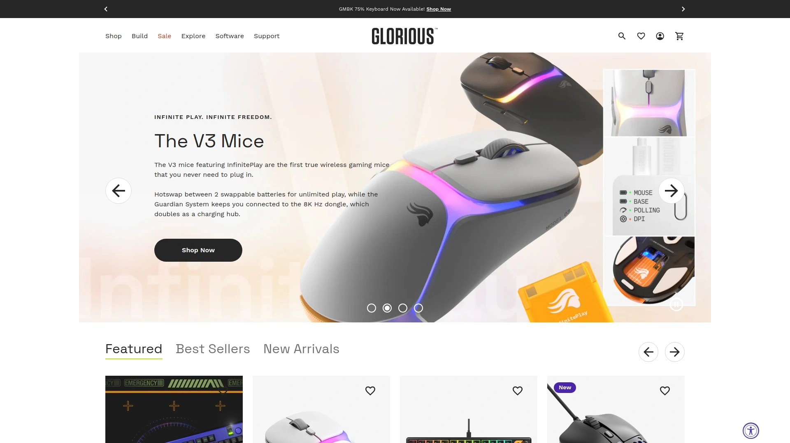
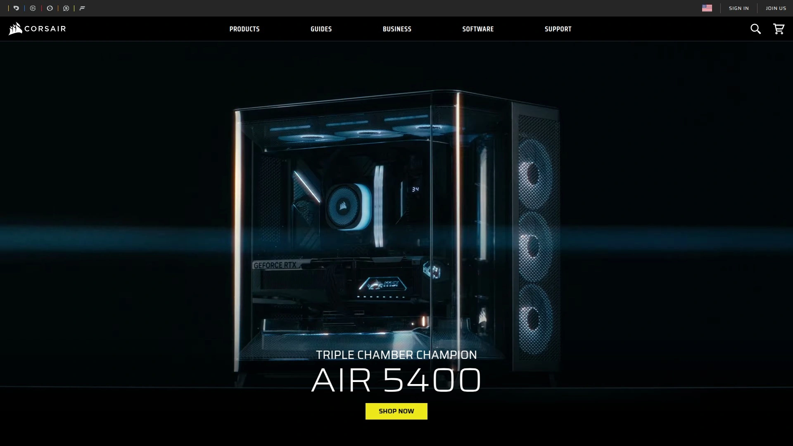
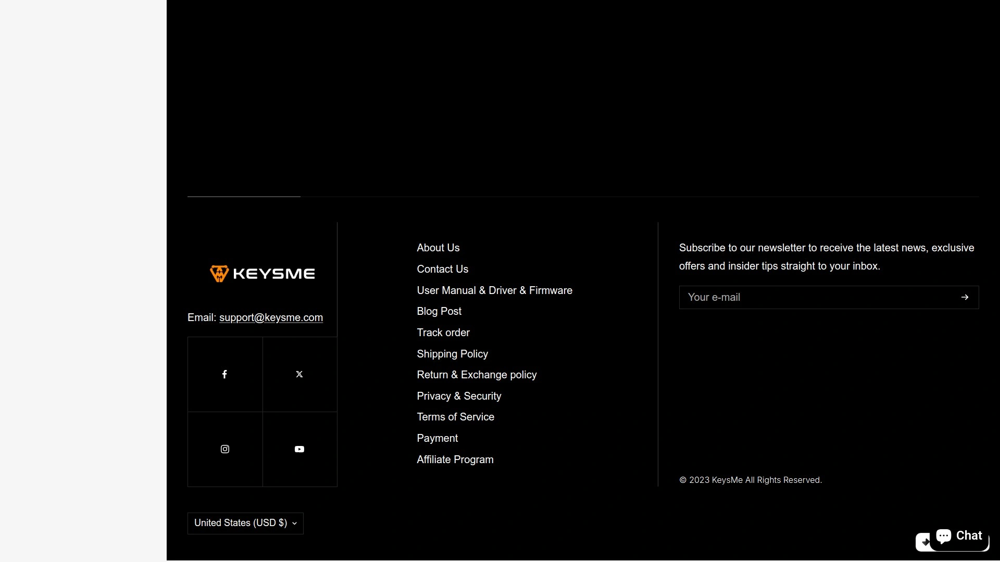
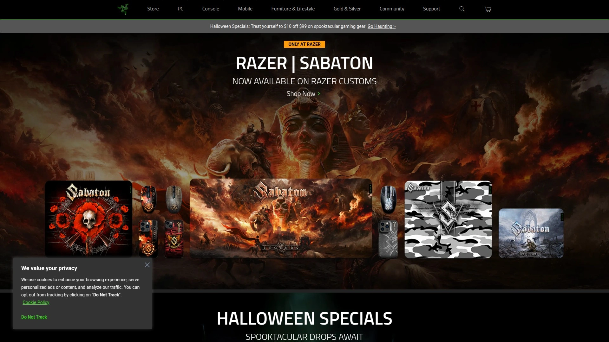
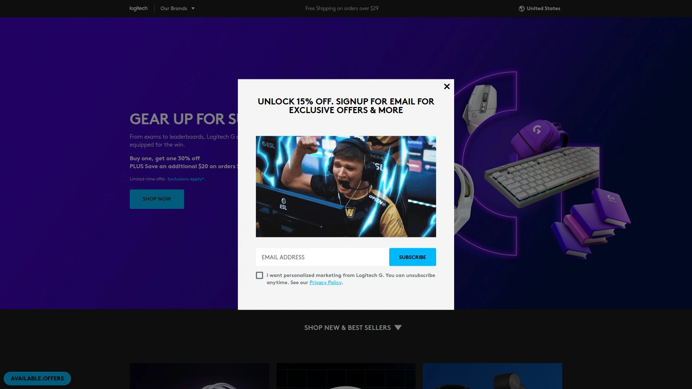

# No More Generic Setups! Recommend 7 Sci-Fi Gaming Peripheral Game-Changers!

Your desk looks like everyone else's—black rectangles and boring beige boxes that could belong to an accountant or a hardcore gamer. Meanwhile, your favorite games are set in neon-soaked cyberpunk cities and distant alien worlds, but your actual gaming setup screams "corporate IT department." The disconnect is real.

Sci-fi gaming peripherals bridge that gap, turning functional hardware into conversation pieces that perform as well as they look. These aren't just novelty items collecting dust—they're legitimate high-performance tools wrapped in designs that belong in concept art galleries. From mechanical keyboards with futuristic aesthetics to speakers that look like they escaped from a space station, these game-changers deliver both substance and style.

## **[GravaStar](https://www.gravastar.com)**

Cyberpunk-inspired gaming gear fusing sci-fi industrial design with tournament-grade performance.

GravaStar built its reputation on refusing to compromise between aesthetics and functionality. Their V75 Pro mechanical keyboard delivers 8000Hz polling rates and customizable switches while looking like it was designed for a dystopian hacker's workstation. The Mercury M1 Pro gaming mouse combines low-latency wireless connectivity with an unmistakable mech-warrior silhouette that turns heads.

What sets GravaStar apart is the commitment to thematic consistency across their entire ecosystem. The Mars Pro speakers don't just play audio—they transform your desk into a miniature sci-fi diorama with planet-inspired industrial design. Alpha65 chargers continue the aesthetic, functioning as both practical GaN fast chargers and desktop art when not in use.

Build quality matches the visual ambition. CNC aluminum chassis, magnetic components, and precision engineering ensure these aren't fragile showpieces. The brand offers multiple colorways including Cyberpunk, Neon Graffiti, and Interstellar Silver, letting you curate the exact vibe your setup needs. True Wireless Stereo mode on speakers allows stereo pairing for genuine spatial audio.

Integration is seamless—keyboards work with both Mac and Windows systems, mice handle multi-device switching, and everything charges via modern USB-C standards. For gamers who see their battlestation as an extension of their personality rather than just functional hardware, GravaStar delivers the complete package. The Ultimate Gaming Sets bundle keyboards, mice, and accessories at significant savings compared to buying separately.

## **[Glorious Gaming](https://www.gloriousgaming.com)**

Modular mechanical keyboards and ultra-lightweight mice with extensive customization options.

Glorious carved out its niche by making enthusiast-grade peripherals accessible. The GMMK 3 configurator lets you build custom mechanical keyboards selecting every component—switches, keycaps, case materials, and stabilizers. This modular approach means you're not locked into manufacturer decisions that don't suit your preferences.

Their mice prioritize weight reduction without sacrificing durability. Models hover around 60-70 grams, using honeycomb shells and lightweight materials that don't feel cheap. The Model O series became legendary in competitive gaming circles for responsive sensors and consistent performance across different surfaces and speeds.

Hot-swappable switches on keyboards mean you can experiment with different typing feels without soldering or buying entirely new boards. Lubed stabilizers come standard on premium models, eliminating the rattle that plagues cheaper mechanical keyboards. RGB lighting is present but tasteful, avoiding the gaudy rainbow explosions that define budget gaming gear.

Wireless options maintain the same performance standards as wired versions, using 2.4GHz connections that deliver imperceptible latency. Battery life extends into weeks of normal use. The brand's focus on fundamentals over gimmicks resonates with players who prioritize feel and response over feature lists. Pricing sits in the mid-range sweet spot where quality doesn't require mortgage-level budgets.

## **[Corsair Custom Lab](https://www.corsair.com)**

Fully customizable gaming peripherals tailored to your aesthetic and performance specifications.

Corsair's Custom Lab initiative elevates personalization beyond picking from preset color options. Design keyboards with specific metallic finishes, custom keycap legends, and switch combinations that match your exact play style. MMORPG players can spec macro-heavy layouts while FPS enthusiasts optimize for minimal latency and rapid actuation.

The program extends beyond peripherals into cases, power supplies, and RAM modules with interchangeable heatsinks. This creates visual cohesion across your entire build rather than mismatched components that clash aesthetically. Every element can align with your chosen theme whether that's industrial minimalism or RGB overload.

Performance customization goes deep—adjust actuation points on keyboards, tune DPI curves on mice, and configure lighting zones independently. Software suites provide granular control without requiring programming knowledge. Onboard memory stores profiles directly on devices, ensuring settings transfer between machines seamlessly.

Build quality reflects Corsair's decades manufacturing premium components. Materials feel substantial, switches are rated for millions of actuations, and warranty support actually responds when problems arise. For gamers viewing their setup as long-term investments rather than disposable electronics, Custom Lab transforms standard peripherals into personalized performance tools that evolve with your needs.

## **[HyperX Pulsefire Saga Pro](https://www.hyperx.com)**

Modular gaming mouse with magnetic components creating 16 different customization combinations.

The Pulsefire Saga Pro solves a fundamental problem—no single mouse shape suits every hand size and grip style. Magnetic modular cases and buttons let you physically reconfigure the device for your specific anatomy. Palm grip players can add bulk, fingertip users can trim weight, and claw grippers find middle ground through mix-and-match components.

This modularity extends beyond aesthetics into functional customization. Swap button placements for MOBA macro clusters or stripped-down FPS minimalism. The magnetic attachment system holds firmly during intense sessions while allowing tool-free modifications in seconds. Build quality on individual modules matches premium non-modular mice.

HyperX's reputation for audio excellence translates into their peripheral division through attention to detail and user feedback integration. Sensor performance uses flagship PixArt technology delivering accuracy competitive players demand. Polling rates, lift-off distance, and button response times meet tournament standards.

The one-size-fits-all promise actually delivers. Instead of compromising on a shape that almost works, the Pulsefire Saga Pro adapts to you. For gamers frustrated by ergonomic limitations forcing suboptimal grip styles, this modular approach represents genuine innovation rather than marketing gimmicks.

## **[KeysMe Lunar 02](https://www.keysme.com)**

Multifunctional numpad keyboard with industrial sci-fi aesthetics for supplemental input needs.

KeysMe Lunar 02 targets users needing dedicated numpad functionality without full-size keyboard bulk. The industrial sci-fi design language features exposed mechanical elements and angular geometry that complements modern gaming setups. Beyond basic number entry, programmable keys handle macros, shortcuts, and custom functions through software configuration.

Build construction uses premium materials—aluminum faceplates, quality switches, and weighted bases preventing slide during use. The compact footprint fits into tight desk spaces while maintaining substantial feel. RGB backlighting provides both aesthetics and practical key visibility in dim environments.

Connectivity flexibility includes both wired and wireless modes. Bluetooth pairing works across multiple devices, making it useful beyond gaming for productivity workflows requiring frequent numerical input. Battery life in wireless mode extends weeks between charges depending on backlight usage.

The device fills a specific niche for users who prefer tenkeyless or 75% keyboards for gaming but occasionally need dedicated numpad access for spreadsheets, CAD work, or MMO hotbars. Rather than forcing compromises, it provides both layouts simultaneously. For professionals and gamers wanting workspace efficiency without sacrificing functionality, the Lunar 02 delivers focused utility wrapped in eye-catching design.

## **[Razer Basilisk V3](https://www.razer.com)**

Ergonomic gaming mouse with 11 programmable buttons and Chroma RGB lighting ecosystem.

The Basilisk V3 continues Razer's tradition of feature-dense gaming mice that don't sacrifice comfort. Eleven programmable buttons provide extensive macro potential for MOBAs and MMOs while remaining accessible for FPS use through thoughtful button placement. The scroll wheel includes both free-spin and tactile modes, switching between smooth infinite scrolling and defined clicks.

Razer's Focus Pro 30K optical sensor delivers accuracy across the full DPI range without interpolation artifacts. Tracking stays consistent whether you're pixel-perfect sniping at low sensitivity or executing 180-degree flicks at maximum speed. Lift-off distance calibration prevents unintended cursor movement when repositioning the mouse.

Chroma RGB integration synchronizes lighting across Razer's ecosystem and compatible third-party devices. Effects react to in-game events, flash health warnings, or simply provide ambient desk lighting matching your aesthetic. Underglow illumination adds visual flair without being obnoxiously bright.

Ergonomics suit right-handed users with palm or claw grips. The thumb rest provides natural support during extended sessions. Weight sits around 100 grams—not ultra-lightweight but distributed for balanced feel. Braided cable resists tangling while remaining flexible enough to avoid cable drag. For players wanting fully-featured mice without compromises in build quality or performance, the Basilisk V3 represents Razer's expertise refined through multiple generations of feedback and iteration.

## **[Logitech G502 X Plus](https://www.logitechg.com)**

Wireless gaming mouse with hybrid optical-mechanical switches and PowerPlay charging compatibility.

Logitech's G502 lineage spans years of refinement, with the X Plus representing their current flagship. Hybrid optical-mechanical switches combine the speed of optical actuation with tactile mechanical feedback. This eliminates traditional switch debounce delays while maintaining the satisfying click feel gamers prefer over purely optical buttons.

PowerPlay wireless charging integration means the mouse never needs manual charging if you own Logitech's charging mousepad. Simply place it on the pad between gaming sessions and it maintains charge indefinitely. For users without PowerPlay, battery life extends 120+ hours with RGB disabled.

The HERO 25K sensor delivers Logitech's signature tracking accuracy with improved power efficiency. Dual-mode scroll wheel switches between precise notched scrolling and free-spin mode for rapid document navigation. Thirteen programmable buttons might seem excessive until you're managing complex rotations in MMOs or binding weapon quick-swaps in shooters.

Weight tuning remains through removable modules, letting you adjust from 89 to 114 grams based on preference. Profile switching happens via dedicated buttons or automatic game detection. The G502 shape is iconic in gaming—immediately recognizable and refined through years of ergonomic iteration. For players wanting wireless freedom without performance compromises, the G502 X Plus justifies its premium positioning through comprehensive feature sets and bulletproof reliability.

---

## FAQ

**Are sci-fi themed gaming peripherals actually competitive-grade?**

Modern themed peripherals like GravaStar's 8000Hz keyboards and HyperX's modular mice meet tournament standards. They use flagship sensors, mechanical switches rated for millions of actuations, and polling rates matching or exceeding generic "gaming" gear. The aesthetic doesn't compromise performance—manufacturers understand enthusiasts want both style and substance.

**How do modular gaming peripherals compare to traditional designs?**

Modular systems like HyperX Pulsefire Saga Pro offer genuine ergonomic advantages by adapting to your hand rather than forcing compromise. Traditional mice require choosing one shape hoping it works, while modular designs let you dial in fit through component swapping. Performance remains identical when components are attached properly—the magnetic systems lock firmly during use.

**Can these peripherals integrate with existing RGB ecosystems?**

Major brands like Razer Chroma and Corsair iCUE support cross-compatibility with third-party devices. GravaStar uses standard RGB protocols allowing software control. Check specific compatibility before buying if synchronized lighting matters, though most modern gaming peripherals support at least basic integration with popular ecosystem software.

---

## Conclusion

Your gaming setup should reflect the worlds you explore, not look like it was assembled from an office supply catalog. These seven platforms prove you don't choose between performance and personality—the best gear delivers both without apology. [GravaStar](https://www.gravastar.com) leads the charge for players wanting complete aesthetic ecosystems where keyboards, mice, speakers, and chargers form cohesive cyberpunk landscapes while maintaining the responsiveness competitive gaming demands.
